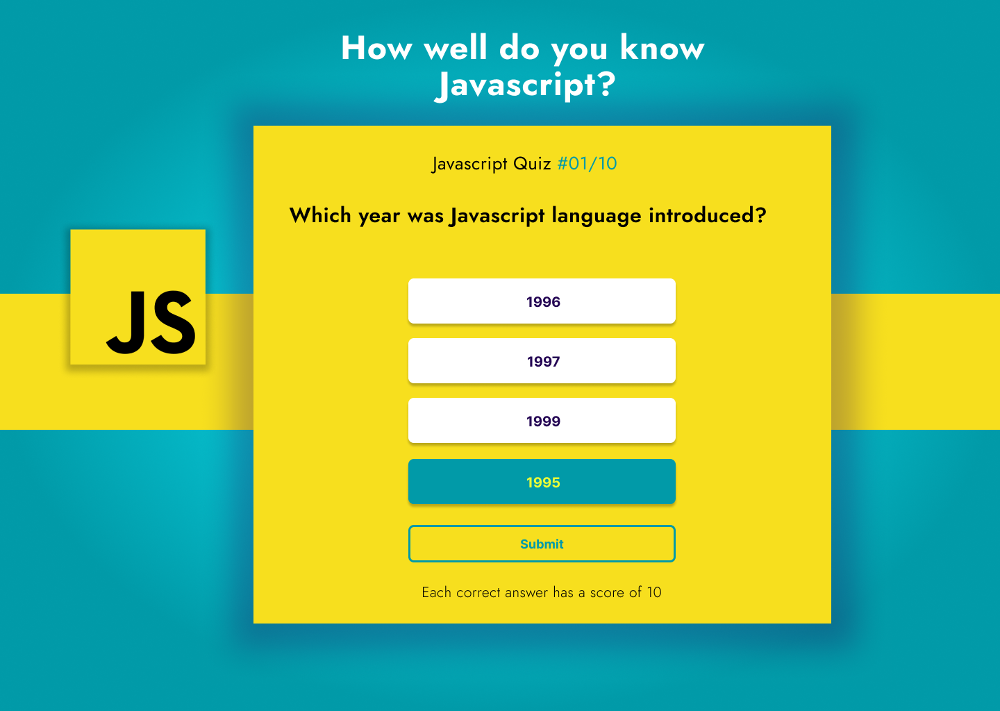

# Quiz Board App
## By Dennis Kimathi

## Screenshot
 

 ## Table of Content
 - [Description](#description)
 - [Features](#features)
 - [Design Driven Development](#Design-Driven-Development)
 - [Requirements](#requirements)
 - [Installation Process](#installation-Process)
 - [Live Link](#Live-Link)
 - [Technology  Used](#technology-Used)
 - [License](#license)
 - [Authors Info](#Authors-Info)

## Description

The Quiz board App iS meant for High School Students learning Javascript. The quiz will help them grasp Javascript concepts.

[Go Back to the top](#quiz-board-app)
## Features
1. As a user, I want to see the multi-choice questions when the website loads. You will create the multi-choice questions to be answered on the website. Each question should have a number of points awarded when scored right.
2. As a user, I want to select the answer which I think is correct from the webpage.
3. As a user, I want to submit my answers when I'm done taking the quiz.
4. As a user, I want to get the results of what I scored after submitting my answers on the website. 

[Go Back to the top](#quiz-board-app)

## Design Driven Development

Use the link to find the project design for the project.

Figma Design -[Quiz-Board-App-Design](https://www.figma.com/file/0GcFH0dKphS0g2L7pa5KNl/Quiz-Board-Design-(Copy)?node-id=109%3A396)

[Go Back to the top](#quiz-board-app)

 ###  Requirements
 * Access to  a computer or any other garget
 * Access to internet

 ### Installation Process
 ****
* Clone to thir repo : git clone https://github.com/Albert-Byrone/delani.git
* Unzip the downloaded files in a folder of choice.
* Open the index file from the zipped file with any browser.
 ****
 [Go Back to the top](#quiz-board-app)

### Live Link
- Click this link to view the live application https://dennohkim.github.io/Quiz-Board-App/

### Technology  Used
* HTML - which was used to develope the structure off the pages.
* CSS - which was used to style the User Interface.
* JAVASCRIPT - which was used for DOM(Document Object Manipulation) scripts.
[Go Back to the top](#quiz-board-app)

## Known Bugs
* None.

## License
MIT License
Copyright (c) [2022] [License](LICENSE.txt)
Permission is hereby granted, free of charge, to any person obtaining a copy
of this software and associated documentation files (the "Software"), to deal
in the Software without restriction, including without limitation the rights
to use, copy, modify, merge, publish, distribute, sublicense, and/or sell
copies of the Software, and to permit persons to whom the Software is
furnished to do so, subject to the following conditions:
The above copyright notice and this permission notice shall be included in all
copies or substantial portions of the Software.
THE SOFTWARE IS PROVIDED "AS IS", WITHOUT WARRANTY OF ANY KIND, EXPRESS OR
IMPLIED, INCLUDING BUT NOT LIMITED TO THE WARRANTIES OF MERCHANTABILITY,
FITNESS FOR A PARTICULAR PURPOSE AND NONINFRINGEMENT. IN NO EVENT SHALL THE
AUTHORS OR COPYRIGHT HOLDERS BE LIABLE FOR ANY CLAIM, DAMAGES OR OTHER
LIABILITY, WHETHER IN AN ACTION OF CONTRACT, TORT OR OTHERWISE, ARISING FROM,
OUT OF OR IN CONNECTION WITH THE SOFTWARE OR THE USE OR OTHER DEALINGS IN THE
SOFTWARE.
[Go Back to the top](#quiz-board-app)

## Authors Info
Slack Profile - [Dennis Kimathi](https://app.slack.com/client/T0101L740P4/C010E0J8BRA/user_profile/U03CYMSV3DZ)

Linked - [Dennis Kimathi](https://www.linkedin.com/in/dennis-kimathi-46326711b/)
[Go Back to the top](#quiz-board-app)